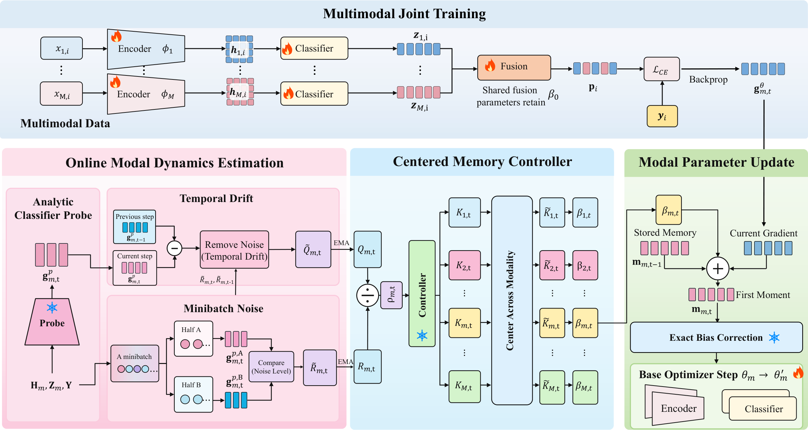

# Adaptive Gradient Memory for Balanced Multimodal Learning

Official PyTorch implementation of **Variance-Calibrated Modal Momentum
(VCMM)**, proposed in *Adaptive Gradient Memory for Balanced Multimodal
Learning* (ICASSP 2027).

VCMM revisits modality imbalance from the perspective of gradient memory.
Instead of assigning the same momentum to every modality, it estimates
modality-specific minibatch noise and temporal drift online, then adapts each
modality's momentum with a centered Kalman-inspired controller.

<p align="center">
  <a href="assets/vcmmpipeline.pdf">
    
  </a>
</p>

<p align="center"><em>
VCMM estimates online modal dynamics, centers modality-specific memory gains,
and applies exact bias correction during the base optimizer update.
</em></p>

## Highlights

- **Adaptive modal memory:** different modalities receive different,
  time-varying momentum coefficients.
- **Variance calibrated:** the controller is driven by online estimates of
  minibatch noise and temporal gradient drift.
- **Optimization-scale preserving:** log-odds centering anchors the controller
  to the base optimizer without modality-specific learning-rate scaling.
- **Exact bias correction:** the complete history of time-varying momentum is
  used to correct the first moment.
- **Lightweight:** the analytic classifier probe reuses the original forward
  pass and adds no encoder forward or backward pass.

This repository provides a reusable implementation of VCMM together with one
self-contained image--text classification example. The optimizer and
controller are implemented independently in `utils/vcmm.py`; VCMM itself is
dataset- and architecture-agnostic and can be integrated into other multimodal
training pipelines.

## Code Structure

```text
.
|-- assets/
|   |-- vcmmpipeline.png      # framework preview for GitHub
|   `-- vcmmpipeline.pdf      # vector-quality framework figure
|-- data/
|   `-- config.json           # experiment configuration
|-- dataset/
|   `-- image_text_dataset.py # example dataset and preprocessing
|-- model/
|   `-- multimodal_model.py   # BERT and ResNet-50 branches
|-- utils/
|   |-- randaugment.py        # image augmentation
|   `-- vcmm.py               # VCMM controller and optimizer
|-- train.py                  # training and evaluation entry point
`-- requirements.txt
```

## Example Data Preparation

Download Twitter15 from its official source and arrange it as follows. Dataset
files are not redistributed by this repository.

```text
Twitter15/
|-- annotations/
|   |-- train.tsv
|   |-- dev.tsv
|   `-- test.tsv
`-- twitter2015_images/
    `-- *.jpg
```

Each TSV must provide the label, image filename, and text in columns 2--4. The
loader accepts both the train/test column names (`Label`, `ImageID`, `String`)
and the prefixed column names used by the official development split.

## Environment

The reference environment uses Python 3.9 and an NVIDIA RTX 4090 GPU.

```bash
python -m venv .venv
source .venv/bin/activate
pip install -r requirements.txt
```

## Training and Evaluation

Run the included example with:

```bash
python train.py \
  --config data/config.json \
  --data-root /absolute/path/to/Twitter15 \
  --device cuda:0 \
  --output-dir outputs/vcmm
```

The default configuration follows the paper setting: Adam learning rate
`2e-5`, weight decay `2e-4`, batch size `32`, base momentum `0.9`, statistics
EMA `0.95`, adaptation strength `1`, a 100-step controller warm-up, drift
floor `1e-4`, and gain range `[0.01, 0.30]`.

By default, Hugging Face downloads `bert-base-uncased` and torchvision loads
ImageNet-1K ResNet-50 weights. A torchvision-compatible checkpoint can be
provided with `--resnet-checkpoint`.

## Citation

If this code is useful in your research, please cite the paper. The final
BibTeX entry will be added after publication.
